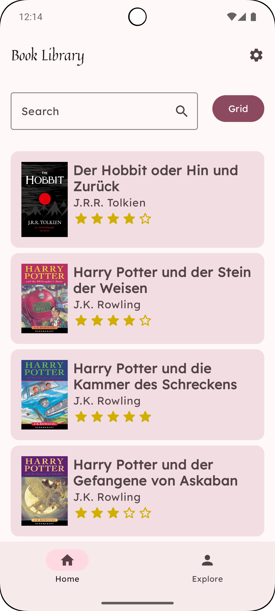
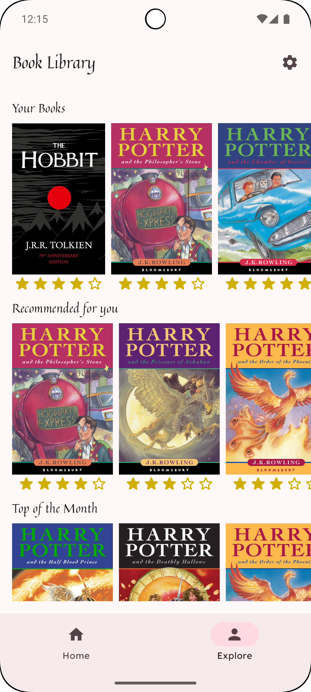
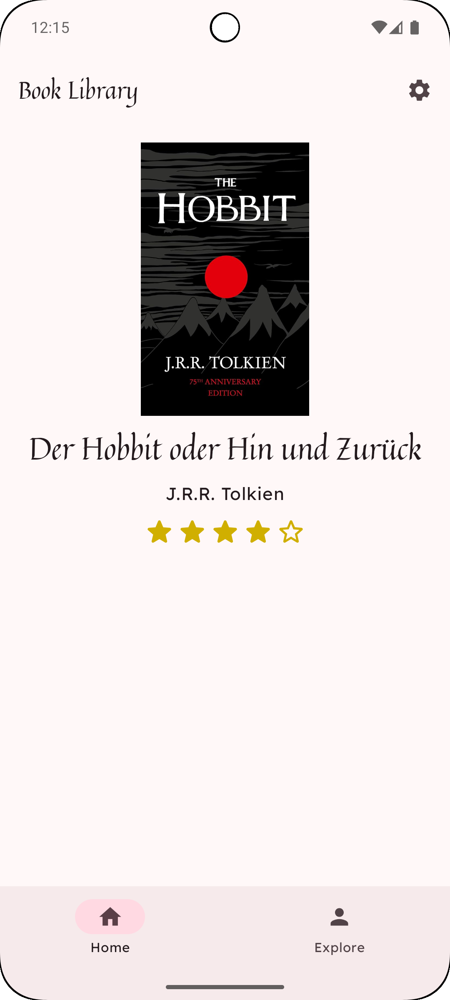

# DreamZzz - dein Fenster zur Traumwelt

**Füge hier einen kurzen, knackigen Slogan ein, um deine App zu bewerben.**

DreamZzz ist deine digitale Begleitung für besseren Schlaf und intensivere Träume. Verwandle deine nächtlichen Abenteuer in visuelle Erinnerungen. Mit intelligentem Schlaftracking unterstützt dich die App dabei, die faszinierende Welt deiner Träume zu entschlüsseln und gleichzeitig deinen Schlaf langfristig zu optimieren.

DreamZzz ist für alle, die ihre Träume besser verstehen, ihren Schlaf optimieren oder einfach einen kreativen Zugang zu ihrer nächtlichen Reise suchen. Egal ob du nach mehr Klarheit, Entspannung oder Inspiration suchst - DreamZzz vereint innovative Technologie mit intuitivem Design, um Träume greifbar zu machen.

Für wen ist sie geeignet? Welches Problem löst sie? Was macht deine App anders/besser als andere Apps?
Vermeide es, hier allzusehr in technische Details zu gehen.

## Design
Füge hier am Ende die Screenshots deiner App ein.

  
  
  

## Features
Kernfunktionen:

- Traumaufzeichnung: Erfasse und speichere deine Träume ganz einfach per Texteingabe, damit sie nicht in Vergessenheit geraten.
- KI-Integration: Verwandle deine Traumbeschreibungen mithilfe künstlicher Intelligenz in faszinierende, individuell generierte Bilder.
- dynamische Traumgalerie: Erhalte eine visuelle Übersicht über deine gespeicherten Träume und ihre KI-generierten Bilder in einer interaktiven Galerie.
- Benutzerverwaltung und Cloud-Speicherung: Erstelle ein Benutzerkonto und sichere deine Träume zuverlässig in der Cloud – jederzeit und von überall abrufbar.
- Emotionen/Stimmung erfassen: Erfasse beim Speichern eines Traums deine Stimmung, um tiefere Einblicke in dein emotionales Erleben zu gewinnen.
- interaktiver Nachthimmel: Jeder eingetragene Traum erscheint als Stern am Himmel – erschaffe deine persönliche Traumgalaxie.
- mehrsprachige Unterstützung: Nutze die App in Deutsch und Englisch für ein intuitives und internationales Erlebnis.

## Technischer Aufbau

#### Projektaufbau
Eine kurze Beschreibung deiner Ordnerstruktur und Architektur (MVVM, Repositories) um Außenstehenden zu helfen, sich in deinem Projekt zurecht zu finden.

#### Datenspeicherung
Welche Daten speicherst du? Wo und wie (Firebase, Core Data)? Erkläre hier auch, warum du den jeweiligen Dienst nutzt (offline-first, Sync usw.).

#### API Calls
Welche APIs verwendest du?

#### 3rd-Party Frameworks
Verwendest du Frameworks/Libraries, die nicht von dir stammen?

## Ausblick
Beschreibe hier, wo die Reise nach deinem Praxisprojekt hin geht. Was möchtest du in Zukunft noch ergänzen?

- [ ] Geplantes Feature 1
- [ ] Geplantes Feature 2
- [ ] ...
