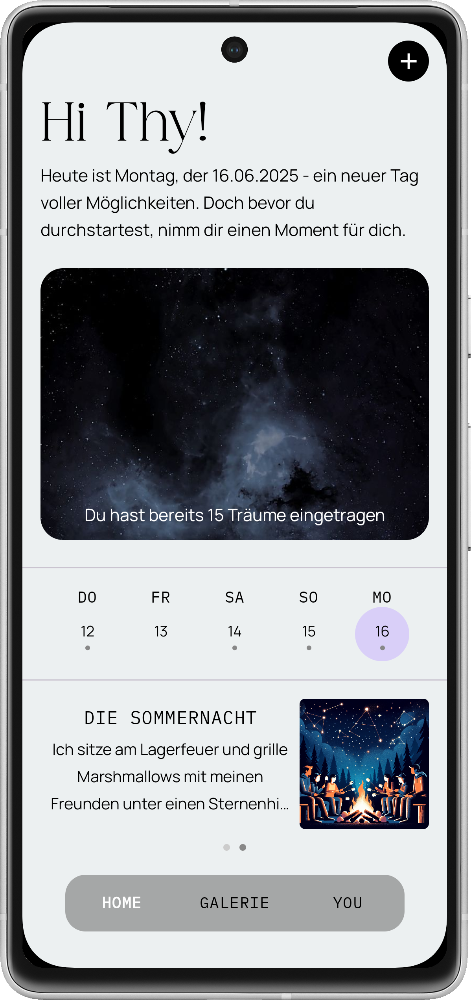
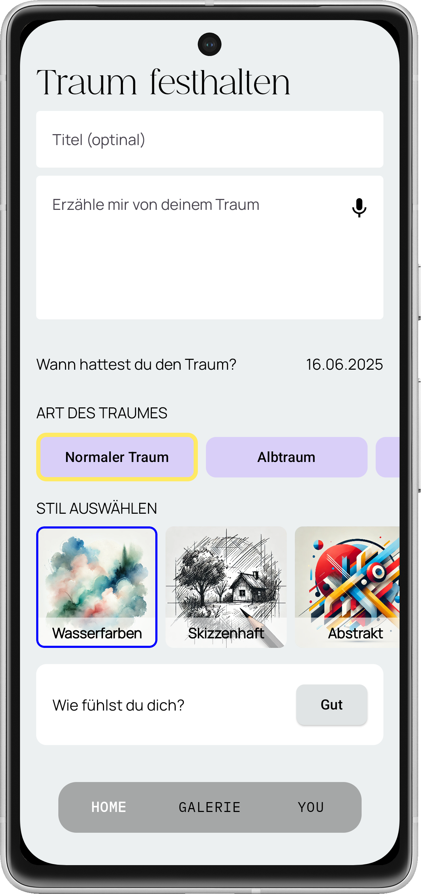
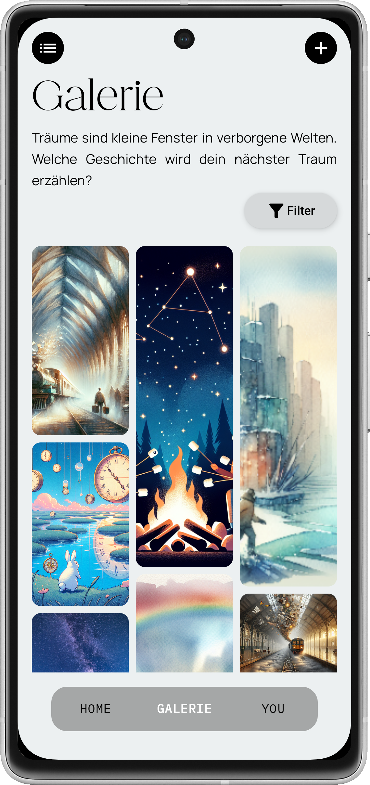
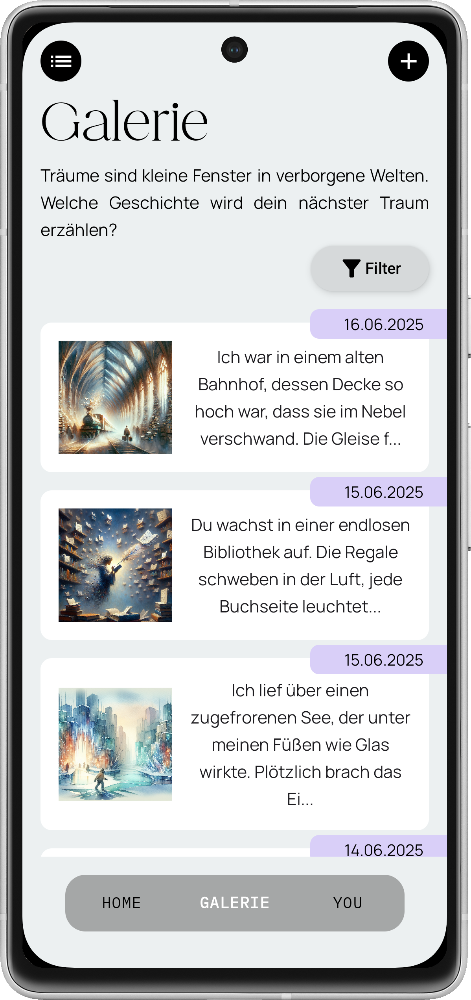
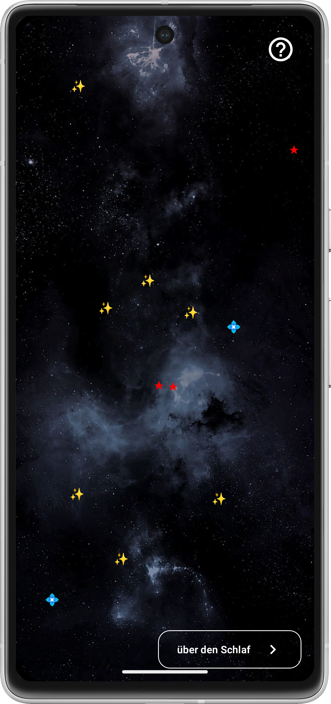
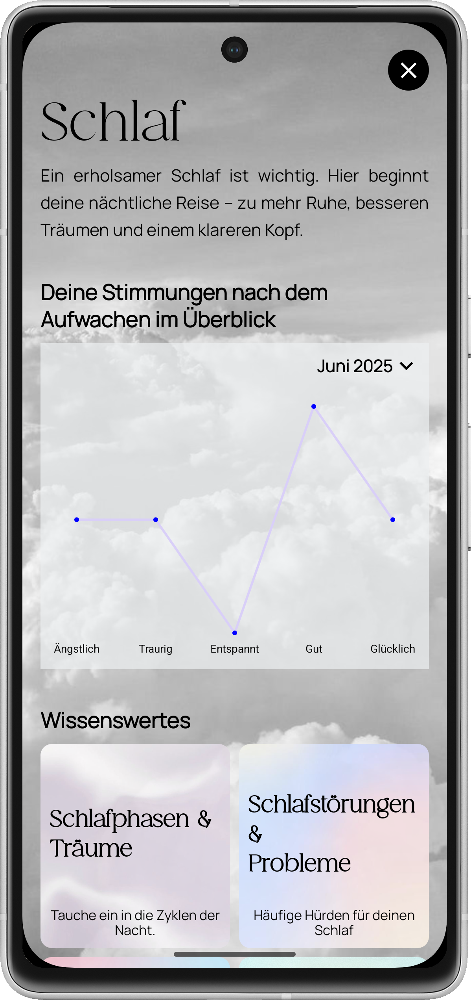
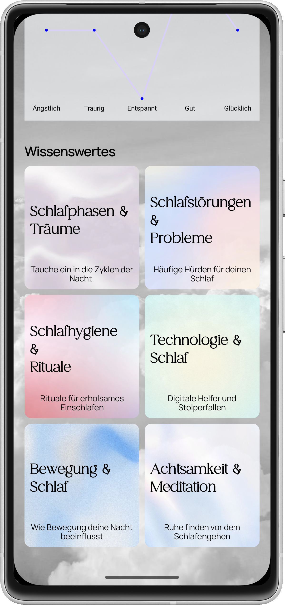
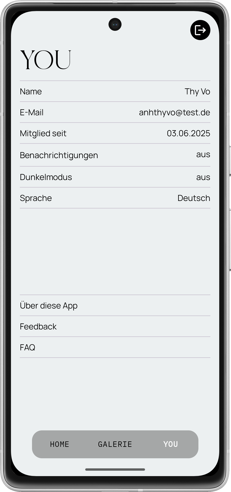

# DreamZzz - dein Fenster zur Traumwelt

DreamZzz ist deine digitale Begleitung für besseren Schlaf und intensivere Träume. Verwandle deine nächtlichen Abenteuer in visuelle Erinnerungen. Mit intelligentem Schlaftracking unterstützt dich die App dabei, die faszinierende Welt deiner Träume zu entschlüsseln und gleichzeitig deinen Schlaf langfristig zu optimieren.

DreamZzz ist für alle, die ihre Träume besser verstehen, ihren Schlaf optimieren oder einfach einen kreativen Zugang zu ihrer nächtlichen Reise suchen. Egal ob du nach mehr Klarheit, Entspannung oder Inspiration suchst - DreamZzz vereint innovative Technologie mit intuitivem Design, um Träume greifbar zu machen.

## Design

  
  
  
  
  
  
  
  
  

#### Minimalistisches Design
Die App setzt auf eine schlichte und moderne Ästhetik mit klaren Linien und einer ruhigen Farbgebung. Farbpalette: Grau, Schwarz und Weiß als Basisfarben, kombiniert mit Flieder als Akzentfarbe für Highlights und interaktive Elemente.

#### Typografie 
Andreas – markant und charakterstark für eine einprägsame Typografie.
Unterüberschriften: IBM Plex Mono Regular – klare, moderne Schrift für Struktur und Lesbarkeit.
Fließtexte: Manrope Regular – eine elegante, leicht lesbare Schrift für ein angenehmes Leseerlebnis.

#### Individuelle Tab Bar
Ermöglicht eine schnelle und intuitive Navigation zwischen den Hauptbereichen:
- Home: Übersicht und Eingabe neuer Träume.
- Galerie: Sammlung gespeicherter Träume mit KI-generierten Bildern.
- Profil: Einstellungen, persönliche Daten und Cloud-Synchronisation.
Klares Icon-Design für eine intuitive Bedienung.

## Features
Kernfunktionen:

- Traumaufzeichnung: Erfasse und speichere deine Träume ganz einfach per Text- oder Spracheingabe, damit sie nicht in Vergessenheit geraten.
- KI-Integration: Verwandle deine Traumbeschreibungen mithilfe künstlicher Intelligenz in faszinierende, individuell generierte Bilder.
- dynamische Traumgalerie: Erhalte eine visuelle Übersicht über deine gespeicherten Träume und ihre KI-generierten Bilder in einer interaktiven Galerie.
- Benutzerverwaltung und Cloud-Speicherung: Erstelle ein Benutzerkonto und sichere deine Träume zuverlässig in der Cloud – jederzeit und von überall abrufbar.
- Emotionen/Stimmung erfassen: Erfasse beim Speichern eines Traums deine Stimmung, um tiefere Einblicke in dein emotionales Erleben zu gewinnen.
- interaktiver Nachthimmel: Jeder eingetragene Traum erscheint als Stern am Himmel – erschaffe deine persönliche Traumgalaxie.
- Wissenswertes über den Schlaf: Entdecke informative Inhalte und spannende Fakten rund um die Themen Schlafzyklen, Traumdeutung und die Bedeutung von Träumen für dein Wohlbefinden.
- mehrsprachige Unterstützung: Nutze die App in Deutsch und Englisch für ein intuitives und internationales Erlebnis.

## Technischer Aufbau

#### Projektaufbau

Die Architektur basiert auf MVVM (Model-View-ViewModel).

Dabei sind die Verantwortlichkeiten wie folgt aufgeteilt:

<b>Models:</b> definieren die Datenstrukturen  
<b>APIs:</b> ermöglichen den Zugriff auf Remote-Datenquellen  
<b>Repositories:</b> zentralisieren den Datenzugriff, indem sie Daten aus lokalen und Remote-Quellen bereitstellen  
<b>ViewModels:</b> bereiten die Daten für die UI auf und verwalten die UI-bezogene Logik  
<b>Screens:</b> repräsentieren vollständige UI-Ansichten  
<b>Components:</b> wiederverwendbare UI-Elemente innerhalb eines Screens  
<b>Navigation:</b> definiert die Navigationsstruktur und Übergänge zwischen Screens  
<b>DI (Dependency Injection):</b> verwalten und liefern Abhängigkeiten mittels Koin  
<b>Utils:</b> beinhaltet allgemeine Hilfsfunktionen und -klassen   

Diese Struktur gewährleistet eine klare Trennung der Verantwortlichkeiten, eine verbesserte Testbarkeit und eine einfache Wartbarkeit der Anwendung.

#### Datenspeicherung

<b>Firebase</b>        für die Benutzeranmeldung und -registrierung
                 -> synchronisiert nahtlos zwischen den Geräten und bietet Cloud-basierte Lösung, die den Zugang von überall sicherstellt
 <b>Firestore</b>       zur Speicherung benutzerspezifischer Daten, um diese sicher und skalierbar zu verwalten
                 -> Flexibilität, schnelle Datenabfrage und Echtzeit-Synchronisierung zwischen Geräten
 <b>Room</b>       für das lokale Speichern von Bildern und Medienelementen
                 -> Offline-Zugriff der Bilder, da die Daten direkt auf dem Gerät gespeichert werden
 <b>DataStore</b>     speichert App-Einstellungen wie Dunkelmodus, Sprache und Benachrichigungseinstellungen, die lokal auf dem Gerät bleiben
                 -> einfache App-Einstellungen lokal auf dem Gerät speichern ohne externe Abhängigkeiten, wobei die Daten sofort nach der Änderung verfügbar sind

#### API Calls

Bilder generieren: DALL·E (OpenAI) zur Erstellung von Bildern basierend auf Traumbeschreibungen  
Bilder analysieren und interpretieren: ChatGPT (OpenAI) zur Analyse und Interpretation von Traumbildern und -texten

## Ausblick
Geplante Features:

- <b>Integrierung von Google Fit:</b> zur Synchronisierung von Schlafdaten und zur tieferen Analyse des Zusammenhangs zwischen Schlafqualität und Traumerinnerung.
- <b>Traum-Coach / Chatbot:</b> ein interaktiver KI-gestützter Assistent, der Nutzern hilft, ihre Träume zu reflektieren und Fragen zu Schlaf und Traum zu beantworten.
- <b>Traumsymbole-Bibliothek:</b> eine interaktive Bibliothek, die die Bedeutung häufig vorkommender Traumsymbolen erklärt und dem Nutzer so hilft, seine Träume besser zu verstehen  
- <b>Anmeldung über Drittanbieter</b> (wie Google oder Apple): einfacher Zugang durch die Anmeldung mit einem Drittanbieter-Konto  
- <b>Gamifizierung:</b> durch Gamification-Elemente werden Nutzer motiviert, regelmäßig ihre Träume zu dokumentieren. Belohnungen und Erfolge (z. B. für das Eintragen von Träumen über mehrere Tage hinweg) fördern die Interaktivität und das Engagement.  
- <b>Monetarisierung – Premium-Mitgliedschaft:</b> die Premium-Mitgliedschaft bietet erweiterte Funktionen, wie z. B. zusätzliche KI-gestützte Traumanalysen, exklusive Traumbilder, die Möglichkeit, eine unbegrenzte Anzahl von Träumen zu speichern oder erweiterte Schlafstatistiken.  
